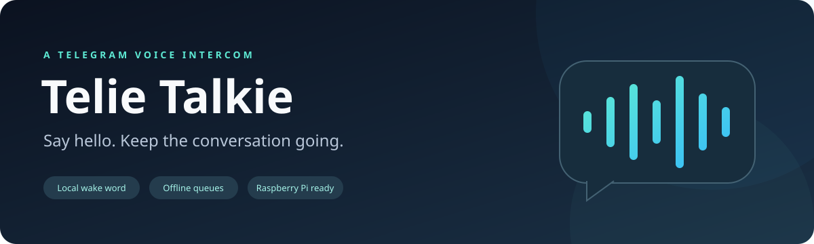
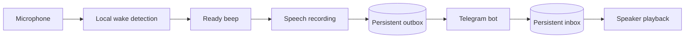

<div align="center">



**Turn a Raspberry Pi into a hands-free Telegram voice intercom.**

[](pyproject.toml)
[](#what-you-need)
[](#how-it-works)
[](LICENSE)

[Quick start](#quick-start) · [Configuration](#configuration) · [Run at startup](docs/setup.md#run-at-startup) · [Troubleshooting](docs/setup.md#troubleshooting)

</div>

Say **“Hello Kitty”**, wait for the beep, and speak. Your bot sends the recording as a Telegram voice message. Send a voice note or audio file back, and the device plays it through its speaker.

### Why Telie Talkie?

- **Hands-free sending.** Local keyword detection starts a recording; silence finishes it.
- **Simple replies.** Telegram voice notes and audio files play automatically, in order.
- **One trusted user.** A one-time private pairing code identifies the allowed chat and sender.
- **Resilient queues.** SQLite and local audio files survive outages and process restarts.
- **Speaker-aware recording.** Microphone processing pauses during tones and playback.
- **Predictable storage.** A configurable 512 MiB audio budget preserves existing queued messages.

### What you need

A Raspberry Pi 4/5 running **64-bit Linux**, Python **3.10+**, a compatible microphone and speaker, FFmpeg with Opus support, and a dedicated Telegram bot. A regular Linux computer also works. Python 3.10 is the minimum supported by the pinned [NumPy dependency](https://pypi.org/project/numpy/2.2.6/); newer supported Python versions also work.

Microphone capture rate, input channels, selected channel, buffering, and latency are configurable. Native **44.1/48 kHz** input is resampled locally to the detector's **16 kHz mono** format. Speaker output defaults to **48 kHz**, with selectable channels and latency. Run the audio check before relying on wake detection.

### Quick start

**1. Install the app.** From a checkout of this repository:

```bash
sudo apt update
sudo apt install python3-venv python3-dev libportaudio2 ffmpeg

python3 -m venv .venv
source .venv/bin/activate
python -m pip install --upgrade pip
python -m pip install -e .
cp config.example.toml config.toml
```

For a fully locked development environment, use `uv sync --locked --extra dev` with [uv](https://docs.astral.sh/uv/).

**2. Create a dedicated bot.** Open [@BotFather](https://t.me/BotFather) in Telegram, send `/newbot`, and follow its prompts. Keep the issued token local. In Bash, read it without putting it in shell history:

```bash
read -r -s -p "Bot token: " TELEGRAM_BOT_TOKEN
printf '\n'
export TELEGRAM_BOT_TOKEN
```

Open your new bot's private chat and tap **Start**. Keep other pollers and webhooks disconnected from this dedicated bot.

**3. Download models and pair.**

```bash
telie-talkie setup-models
telie-talkie pair
```

Send the printed `/pair <one-time-code>` command to the bot **in a private chat**. Paste the returned `chat_id` and `user_id` into the `[telegram]` section of your local `config.toml`. Pairing expires after five minutes by default and does not edit your configuration automatically.

**4. Check your audio and start.**

```bash
telie-talkie devices
# Set input_device and output_device in config.toml if defaults are unsuitable.
telie-talkie doctor --online --audio-check
telie-talkie run
```

Say **“Hello Kitty”**, wait until the beep ends, and speak. Pause for **1.5 seconds** to send. Reply with a Telegram voice note to hear it on the device.

### How it works



The device defaults to sherpa-onnx's **int8 GigaSpeech English keyword model**. Silero VAD detects speech locally. By default, it waits up to **5 seconds** for speech after the beep, stops after **1.5 seconds of silence**, and limits the whole recording window to **60 seconds**. These timings and the model files can be changed in configuration. Empty recordings are discarded. A short pre-roll preserves the beginning of speech while VAD confirms it; the wake phrase and beep are excluded.

FFmpeg creates **OGG/Opus** recordings for Telegram's `sendVoice` API. Incoming messages are received through long polling and saved as durable work before the next polling offset acknowledges them. A separate download worker validates incoming media before playback. Recording and playback share one audio loop; network work continues independently.

### Configuration

The commented [example configuration](config.example.toml) lists every setting. Existing configuration files continue to work; omitted settings use defaults. Relative storage and model directories resolve beside the TOML file, and individual model paths resolve inside the model directory. Use an alternative file with `telie-talkie --config /path/to/config.toml run`.

Operational options include native audio format and channel routing, gains, hardware and processing block sizes, buffers, latency, tone pitch and duration, Opus encoding, network and conversion timeouts, retry policy, worker intervals, pairing, model selection, and log level. See the [configuration guide](docs/configuration.md) for examples and compatibility requirements.

| Setting | Default | Purpose |
| --- | --- | --- |
| `telegram.chat_id`, `telegram.user_id` | Unpaired | Both must match an incoming private message |
| `telegram.token_env` | `TELEGRAM_BOT_TOKEN` | Interactive environment variable containing the bot token |
| `telegram.token_file_env` | `TELEGRAM_BOT_TOKEN_FILE` | Environment variable containing a mounted token file path |
| `telegram.token_credential` | `telegram_bot_token` | Credential filename inside systemd's credential directory |
| `audio.input_device`, `audio.output_device` | System defaults | PortAudio index or matching device name |
| `audio.input_sample_rate`, `audio.input_channels` | `16000`, `1` | Native capture format, converted locally for detection |
| `audio.input_channel` | `0` | Select a channel, or use `-1` to average channels |
| `audio.block_size`, `audio.buffer_blocks` | `512`, `64` | Hardware capture buffering |
| `audio.volume`, `audio.beep_volume` | `0.8`, `0.2` | Playback and tone amplitude |
| `detection.wake_phrase` | `HELLO KITTY` | English wake phrase, tokenized automatically |
| `detection.keywords_threshold` | `0.25` | Increase to make triggering harder |
| `detection.vad_threshold` | `0.5` | Speech detection threshold |
| `recording.speech_wait_seconds` | `5.0` | Wait for speech after the beep |
| `recording.silence_seconds` | `1.5` | Silence needed to finish a recording |
| `recording.max_seconds` | `60.0` | Maximum recording window |
| `codec.bitrate_bps`, `codec.complexity` | `24000`, `10` | Voice quality, bandwidth, and encoding CPU use |
| `network.*_timeout_seconds` | `15` connect, `90` others | Tune for slow or unreliable networks |
| `retry.max_seconds` | `300.0` | Maximum retry backoff, including jitter |
| `logging.level` | `INFO` | Diagnostic verbosity with credential redaction |
| `storage.max_audio_bytes` | `536870912` | Audio budget, including partial downloads |
| `telegram.max_download_bytes` | `20000000` | Incoming compressed file limit |
| `telegram.max_incoming_seconds` | `300.0` | Incoming decoded duration limit |

### Offline behavior

Queued recordings retry uploads with backoff. Download failures retry without letting later incoming audio overtake earlier work. Restarting recovers pending uploads/downloads and **replays interrupted playback from the beginning**. Completed audio files are deleted. Oversized, undecodable, and unstorable new incoming audio is rejected with a queued Telegram error notice; later messages can still play. A recording that cannot be stored produces an error tone and a queued notice.

Only stored messages survive a restart; an unfinished recording is not yet queued. Telegram keeps updates that the device has not received for at most **24 hours**, and the hosted Bot API limits downloads to **20 MB**. If an upload succeeds but its response is lost, retrying may send a duplicate. See the [Telegram Bot API](https://core.telegram.org/bots/api#getting-updates).

### Commands

| Command | Action |
| --- | --- |
| `run` | Listen, record, poll, upload, and play replies |
| `devices` | List microphone and speaker devices |
| `setup-models` | Download models and verify they load |
| `pair [--timeout SECONDS]` | Print one-time pairing instructions and matching IDs |
| `doctor [--online] [--audio-check]` | Check dependencies, models, audio, and optionally Telegram |

For startup, follow the [systemd installation guide](docs/systemd.md). The [service](deploy/telie-talkie.service) uses a dedicated account, a root-owned token supplied through systemd credentials, private persistent state, graceful shutdown, and automatic recovery. See the [device setup guide](docs/setup.md) for hardware calibration and troubleshooting.

### Development

```bash
python -m pip install -e '.[dev]'
ruff check src tests
ruff format --check src tests
pytest -q
```

Tests use fake audio and Telegram adapters for recording, playback suppression, authorization, FIFO retries, capacity, deduplication, and restart recovery. FFmpeg integration tests exercise real Opus, MP3, and AAC conversion. Optional [model tests](tests/test_models.py) use downloaded models without requiring a microphone. On Linux with a running user systemd manager, `TELIE_TEST_SYSTEMD=1 pytest -q tests/test_service.py` also checks real credential delivery. Shutdown tests send SIGTERM and verify queue recovery. CI tests Python 3.10, 3.11, 3.12, and 3.13, including worker failure and converter cancellation cleanup.

```bash
# After setup-models, include real keyword/VAD inference in the test run:
TELIE_TEST_MODELS=1 pytest -q
```

Before publishing a fork, keep **tokens, local configuration, pairing IDs, recordings, model downloads, database files, and logs** out of Git. The supplied ignore rules exclude common runtime artifacts; use a separate storage directory for deployments. Runtime logs omit message contents and wrap Telegram errors without credential-bearing URLs.

### Scope and license

V1 exchanges completed recordings with one private Telegram user. Live streaming, groups, multiple devices, and transcription are outside scope. Wake accuracy and audio routing need calibration on the actual hardware; the automated suite does not certify a particular microphone or speaker.

The application is [MIT licensed](LICENSE). Models are downloaded separately from [sherpa-onnx's official releases](https://k2-fsa.github.io/sherpa/onnx/kws/pretrained_models/index.html); consult their upstream terms when distributing model files.
